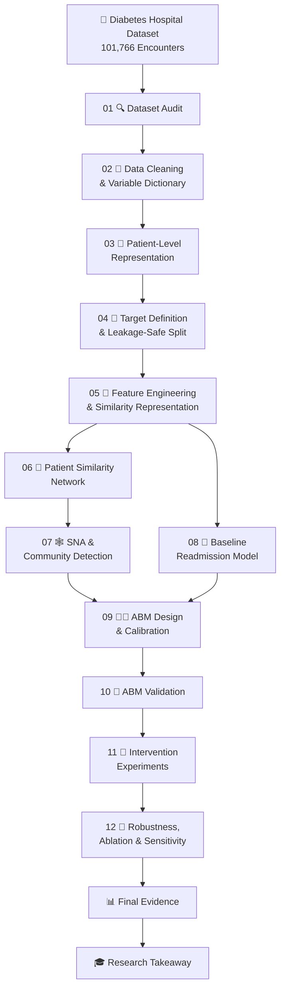
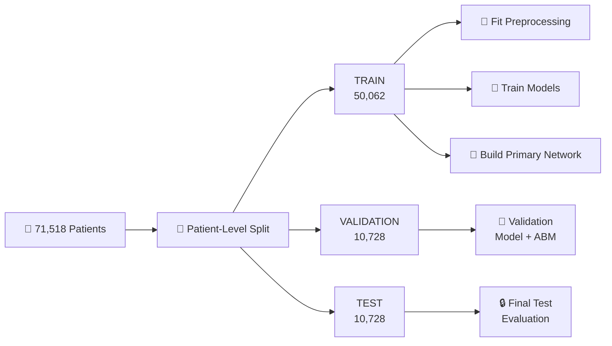
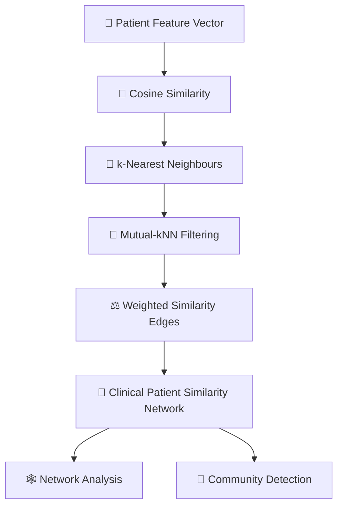
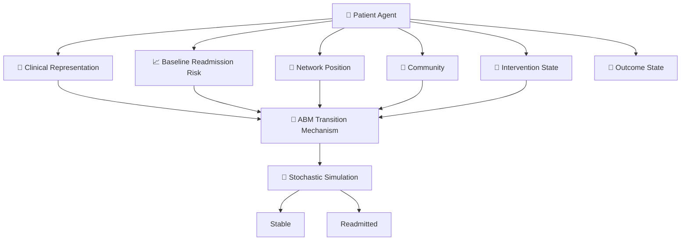
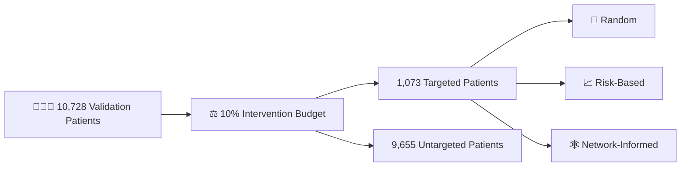
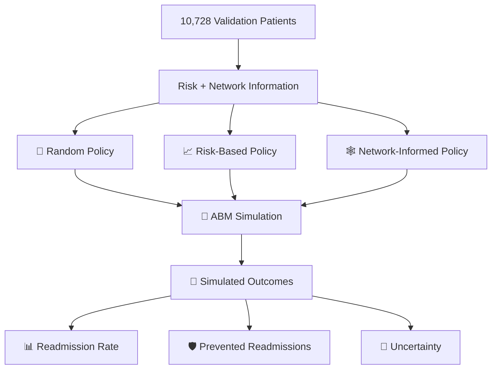
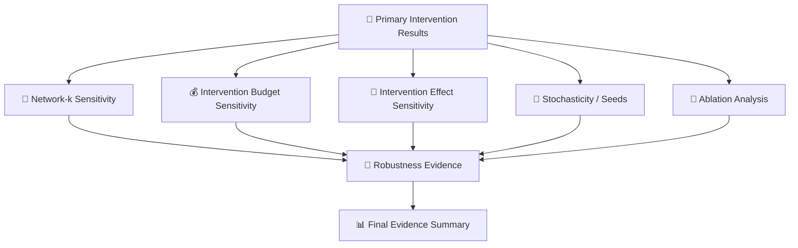
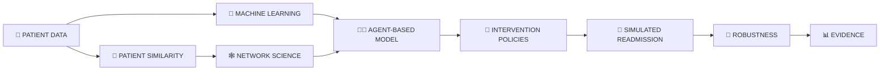
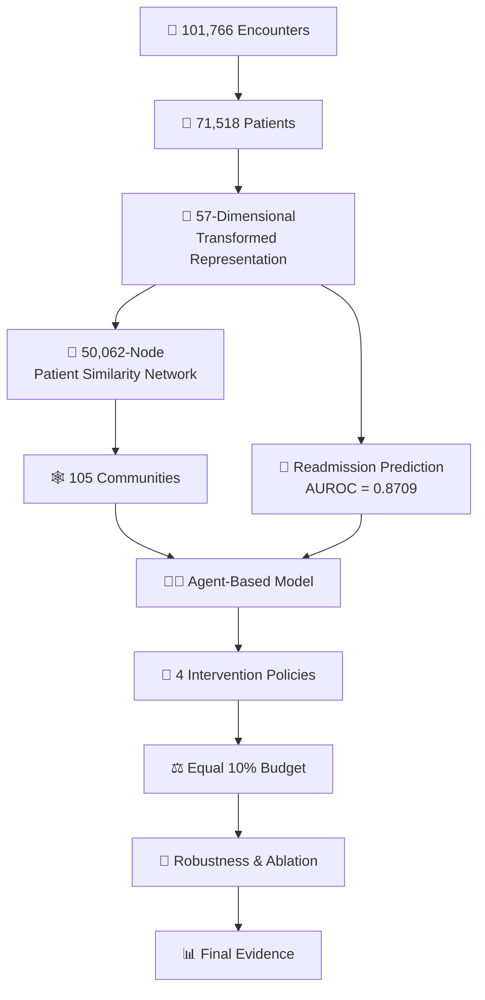

````markdown
# 🏥 Patient Similarity Network + Agent-Based Modelling for Hospital Readmission

<p align="center">


</p>

<p align="center">

### 🔬 From Clinical Data → Patient Similarity → Network Science → Machine Learning → ABM → Intervention Simulation

</p>

---

## 🌟 Project Overview

Hospital readmission is a complex healthcare problem influenced by a combination of clinical characteristics, previous healthcare utilization, diagnosis patterns, medication burden and patient context.

Traditional machine-learning approaches generally treat patients as independent observations.

This project takes a different approach.

> **Can relationships between clinically similar patients be represented as a patient similarity network and integrated with Agent-Based Modelling to evaluate targeted intervention strategies for hospital readmission?**

The project develops an end-to-end computational framework combining:

- 🧹 Clinical data preprocessing
- 👤 Patient-level representation
- 🔐 Leakage-controlled machine learning
- 🧬 Clinical feature engineering
- 🔗 Patient similarity networks
- 🕸️ Social Network Analysis techniques
- 🤖 Readmission prediction
- 🧑‍💻 Agent-Based Modelling
- 🎯 Intervention policy simulation
- 🔬 Robustness and sensitivity analysis

---

# 🎯 Problem Statement

Hospital readmission is not determined by a single factor.

Patients may have different:

- clinical conditions
- healthcare utilization histories
- medication burdens
- diagnosis and procedure patterns
- demographic characteristics
- relationships to other clinically similar patients

A conventional predictive model can estimate the probability of readmission for an individual patient.

However, it does not explicitly represent the **structural relationships between clinically similar patients**.

Therefore, this project investigates:

> **How can a clinical patient similarity network be combined with readmission prediction and Agent-Based Modelling to evaluate targeted intervention strategies?**

---

# ❓ Research Question

### Main Research Question

> **How does the structure of a clinical patient similarity network contribute to the simulation and evaluation of targeted interventions for hospital readmission?**

### Supporting Questions

1. Can encounter-level clinical data be transformed into reliable patient-level representations?
2. Can clinically similar patients be connected without using the readmission outcome?
3. What structural patterns exist within the resulting patient similarity network?
4. How accurately can readmission risk be predicted?
5. Can an Agent-Based Model reproduce observed validation-population behaviour?
6. How do random, risk-based and network-informed targeting strategies behave under an equal intervention budget?
7. How robust are the results to network construction, intervention effectiveness and stochasticity?

---

# 📊 Dataset

## Diabetes 130-US Hospitals for Years 1999–2008

The project uses the **Diabetes 130-US Hospitals for Years 1999–2008** dataset.

The original data is encounter-level clinical data from diabetic patients across US hospitals.

### Dataset at a Glance

| Property | Value |
|---|---:|
| 🏥 Hospital encounters | **101,766** |
| 👤 Unique patients | **71,518** |
| 📊 Variables | **50** |
| 🧾 Unique encounter IDs | **101,766** |
| 🔁 Exact duplicate rows | **0** |
| 📅 Dataset period | **1999–2008** |

---

# 📈 Original Readmission Distribution

The original dataset contains three readmission categories:

| Category | Meaning | Encounters |
|---|---|---:|
| `NO` | No observed readmission | **54,864** |
| `>30` | Readmission after 30 days | **35,545** |
| `<30` | Readmission within 30 days | **11,357** |

The primary project target is constructed at the patient level as:

```text
any_observed_readmission_under_30d
````

A patient receives:

```text
1 → if at least one observed encounter is labelled <30

0 → otherwise
```

---

# 👤 Why Patient-Level Aggregation?

The original dataset contains **encounters**, not one row per patient.

Therefore, the same patient can appear multiple times.

For example:

```text
Raw Encounter Data

Patient A ── Encounter 1
          ── Encounter 2
          ── Encounter 3

Patient B ── Encounter 4
          ── Encounter 5

Patient C ── Encounter 6
```

These records are transformed into:

```text
Patient-Level Representation

Patient A → Clinical + Utilization Profile
Patient B → Clinical + Utilization Profile
Patient C → Clinical + Utilization Profile
```

This is essential because the network is defined as:

> **Patient → Patient**

rather than:

> **Encounter → Encounter**

---

# 🏗️ Complete Project Pipeline



---

# 🧭 Notebook-by-Notebook Workflow

| Notebook                              | Stage             | Main Purpose                          |
| ------------------------------------- | ----------------- | ------------------------------------- |
| `01_dataset_audit.ipynb`              | 🔍 Audit          | Dataset integrity and reproducibility |
| `02_cleaning.ipynb`                   | 🧹 Cleaning       | Missing values and variable selection |
| `03_patient_representation.ipynb`     | 👤 Representation | Encounter → patient transformation    |
| `04_split_leakage_check.ipynb`        | 🔐 Leakage        | Target definition and patient split   |
| `05_features_similarity.ipynb`        | 🧬 Features       | Feature engineering and similarity    |
| `06_similarity_network.ipynb`         | 🔗 Network        | Patient similarity network            |
| `07_sna_communities.ipynb`            | 🕸️ SNA           | Centrality and communities            |
| `08_baseline_readmission_model.ipynb` | 🤖 ML             | Readmission prediction                |
| `09_abm_design_calibration.ipynb`     | 🧑‍💻 ABM         | ABM design and calibration            |
| `10_abm_validation.ipynb`             | 🧪 Validation     | Validate ABM against observations     |
| `11_intervention_experiments.ipynb`   | 🎯 Intervention   | Policy experiments                    |
| `12_robustness_final.ipynb`           | 🔬 Robustness     | Sensitivity and ablation              |

---

# 🔐 Leakage-Control Strategy

A central methodological requirement is preventing information leakage.



### Leakage Controls

* ✅ Patient-level splitting
* ✅ No patient overlap between splits
* ✅ Similarity preprocessing fitted on training data
* ✅ Readmission outcome excluded from similarity construction
* ✅ Patient identifiers excluded from feature matrices
* ✅ Test data not used for model selection
* ✅ Classification threshold selected using validation data
* ✅ Final test evaluation performed after model selection

### Split Sizes

| Split         |   Patients |
| ------------- | ---------: |
| 🧠 Training   | **50,062** |
| 🧪 Validation | **10,728** |
| 🔒 Test       | **10,728** |
| **Total**     | **71,518** |

---

# 🧬 Patient Representation

Patient-level representation combines clinical and utilization information.

Representative feature groups include:

```text
Clinical characteristics
        │
        ├── Demographics
        ├── Diagnosis burden
        ├── Procedure burden
        ├── Medication burden
        │
        └── Healthcare utilization
                ├── Inpatient
                ├── Emergency
                └── Outpatient
```

---

# 🧮 Feature Engineering

Notebook 05 produced:

| Feature Type         |  Count |
| -------------------- | -----: |
| Candidate features   | **38** |
| Numeric features     | **32** |
| Categorical features |  **6** |
| Transformed features | **57** |

The feature transformation pipeline was fitted using the training population and subsequently applied to validation and test populations.

---

# 🔗 Patient Similarity Network

The project constructs a:

## **Clinical Patient Similarity Network**

⚠️ This is **not a social network**.

A node represents a patient.

An edge represents clinical similarity.

The edge weight represents similarity strength.



---

# 📊 Primary Network Results

The primary network uses:

```text
Similarity metric = Cosine similarity
Network rule      = Mutual k-nearest neighbours
k                 = 10
```

### Network Statistics

| Measure                       |        Result |
| ----------------------------- | ------------: |
| 👤 Nodes                      |    **50,062** |
| 🔗 Edges                      |   **434,595** |
| 🎯 k                          |        **10** |
| 📉 Density                    | **0.0003468** |
| 📊 Mean degree                |     **17.36** |
| 📊 Median degree              |        **18** |
| ⚖️ Mean edge weight           |    **0.9184** |
| ⚖️ Median edge weight         |    **0.9260** |
| 🧩 Connected components       |        **82** |
| 🌐 Largest component fraction |    **98.33%** |

The network is sparse in terms of overall density while most patients belong to one large connected component.

---

# 🕸️ Social Network Analysis

Network structure was analysed using:

* Degree
* Weighted degree / strength
* Betweenness centrality
* Closeness centrality
* Eigenvector centrality
* Connected components
* Community structure

Approximation methods were used for computationally expensive centrality measures where appropriate.

---

# 🧩 Community Detection

Primary community detection:

> **Weighted Louvain**

### Results

| Measure                |             Result |
| ---------------------- | -----------------: |
| 🧩 Communities         |            **105** |
| 🏘️ Largest community  | **6,767 patients** |
| 📐 Weighted modularity |         **0.8652** |

A label-propagation sensitivity analysis was also performed.

---

# 🧠 Network Information

The network allows the project to represent:

```text
Patient
   │
   ├── Clinical profile
   ├── Predicted risk
   ├── Similar patients
   ├── Degree
   ├── Weighted degree
   ├── Centrality
   └── Community membership
```

This network context becomes an additional source of information for the ABM intervention experiments.

---

# 🤖 Baseline Readmission Model

Two baseline predictive models were evaluated:

### 1. Logistic Regression

### 2. Random Forest

Model selection was performed using the validation population.

The predefined primary model-selection metric was:

> **Validation AUPRC**

---

# 📈 Model Comparison

### Validation Performance

| Model               |      AUROC |      AUPRC |  Brier |
| ------------------- | ---------: | ---------: | -----: |
| Logistic Regression |     0.8708 |     0.5770 | 0.0751 |
| Random Forest       | **0.8770** | **0.5933** | 0.1203 |
| Prevalence baseline |     0.5000 |     0.1235 | 0.1083 |

The Random Forest was selected according to the predefined validation-AUPRC criterion.

---

# 🏆 Final Test Performance

After model and threshold selection were completed using the training/validation workflow, the held-out test population was evaluated.

| Metric      | Final Test Result |
| ----------- | ----------------: |
| ROC-AUC     |        **0.8709** |
| PR-AUC      |        **0.5883** |
| Brier Score |        **0.1224** |
| Accuracy    |        **0.8702** |
| Precision   |        **0.4826** |
| Recall      |        **0.7019** |
| F1-score    |        **0.5720** |

### Selected Classification Threshold

```text
Threshold = 0.70
```

---

# 📊 Confusion Matrix

```text
                         Predicted
                       0          1
                    -----------------
Actual 0          | 8406 |      997 |
                    -----------------
Actual 1          |  395 |      930 |
                    -----------------
```

Therefore:

```text
True Negatives  = 8406
False Positives = 997
False Negatives = 395
True Positives  = 930
```

---

# 🧑‍💻 Agent-Based Model

The ABM represents patients as computational agents.

Each agent has a state representing the patient's simulated clinical/readmission situation.



---

# 🔄 ABM Transition Mechanism

The ABM follows a probabilistic transition mechanism:

```text
Baseline Risk
      │
      ▼
Calibration
      │
      ▼
Transition Probability
      │
      ▼
Random Draw
      │
 ┌────┴────┐
 ▼         ▼
Stable   Readmitted
```

The simulation introduces stochasticity while preserving the underlying patient-specific risk structure.

---

# 🧪 ABM Validation

The ABM is evaluated against the observed validation population.

### Validation population

**10,728 patients**

The validation simulation uses the same patient population as the observed validation dataset.

The observed readmission outcome is used for **evaluation**, not to construct the similarity network or define the simulation transition rule.

---

# 🎯 Intervention Experiments

Notebook 11 evaluates four intervention policies:

| Policy                 | Description                            |
| ---------------------- | -------------------------------------- |
| ⚪ `no_intervention`    | No intervention                        |
| 🎲 `random`            | Randomly selected patients             |
| 📈 `risk_based`        | Highest-risk patients targeted         |
| 🕸️ `network_informed` | Risk combined with network information |

---

# ⚖️ Equal Intervention Budget

To ensure a fair comparison, all targeted policies receive the same intervention budget.

### Validation population

```text
10,728 patients
```

### Intervention budget

```text
10%
```

### Targeted patients

```text
1,073
```



This equal-resource design ensures that the policies are compared under the same intervention capacity.

---

# 🎯 Intervention Experiment Framework



---

# 📊 Intervention Results

The intervention experiments use repeated stochastic simulations.

Main outputs are stored in:

```text
results/11_intervention_policy_summary.csv
results/11_intervention_replication_results.csv
results/11_paired_policy_comparisons.csv
results/11_target_selection_audit.csv
results/11_intervention_config.json
results/11_validation_network_nodes.csv
results/11_validation_similarity_edges_k10.csv
```

Main figures:

```text
figures/11_intervention_policy_comparison.png
figures/11_prevented_readmissions.png
```

These outputs contain:

* policy-level summaries
* replication-level results
* paired policy comparisons
* target-selection audits
* intervention configuration
* validation network information

---

# 🔬 Robustness Analysis

The final notebook evaluates whether the observed simulation behaviour is sensitive to modelling assumptions.

The robustness analysis includes:

### 🔗 Network-k sensitivity

Examines changes under different network neighbourhood sizes.

### 💰 Budget sensitivity

Examines different intervention-resource assumptions.

### 🎯 Effect-size sensitivity

Examines different intervention-effect assumptions.

### 🎲 Stochasticity

Repeats simulations using different random seeds.

### 🧩 Ablation analysis

Examines the contribution of network-related components.

---

# 🛡️ Robustness Framework



---

# 📁 Repository Structure

```text
ABM-medical_readmission/
│
├── 📄 README.md
├── 📄 ABM_SNA_Proposal.docx
│
├── 📂 diabetes+130-us+hospitals+for+years+1999-2008/
│   ├── diabetic_data.csv
│   └── IDS_mapping.csv
│
├── 📂 notebooks/
│   │
│   ├── 01_dataset_audit.ipynb
│   ├── 02_cleaning.ipynb
│   ├── 03_patient_representation.ipynb
│   ├── 04_split_leakage_check.ipynb
│   ├── 05_features_similarity.ipynb
│   ├── 06_similarity_network.ipynb
│   ├── 07_sna_communities.ipynb
│   ├── 08_baseline_readmission_model.ipynb
│   ├── 09_abm_design_calibration.ipynb
│   ├── 10_abm_validation.ipynb
│   ├── 11_intervention_experiments.ipynb
│   ├── 12_robustness_final.ipynb
│   │
│   └── 📊 ABM_SNA_Final_Presentation.ipynb
│
├── 📂 results/
│   ├── 01_*
│   ├── 02_*
│   ├── 03_*
│   ├── 04_*
│   ├── 05_*
│   ├── 06_*
│   ├── 07_*
│   ├── 08_*
│   ├── 09_*
│   ├── 10_*
│   ├── 11_*
│   └── 12_*
│
└── 📂 figures/
    ├── 10_observed_vs_simulated.png
    ├── 11_intervention_policy_comparison.png
    ├── 11_prevented_readmissions.png
    ├── 12_ablation_effects.png
    ├── 12_mean_weighted_degree.png
    ├── 12_network_density.png
    ├── 12_risk_network_robustness.png
    ├── 12_robustness_summary.png
    └── 12_targeting_policy_*.png
```

---

# 🗃️ Results Organization

Each notebook produces machine-readable evidence.

```text
01 → Dataset Audit
02 → Cleaning
03 → Patient Representation
04 → Split & Leakage
05 → Features
06 → Network
07 → SNA
08 → ML
09 → ABM Design
10 → ABM Validation
11 → Intervention
12 → Robustness
```

The `results/` folder therefore acts as the project's **evidence layer**.

The `figures/` folder contains the main visual outputs.

The `notebooks/` folder contains the complete computational workflow.

---

# 🧰 Technologies Used

| Technology      | Role                      |
| --------------- | ------------------------- |
| 🐍 Python       | Main programming language |
| 🐼 Pandas       | Data manipulation         |
| 🔢 NumPy        | Numerical computation     |
| 🤖 Scikit-learn | Machine learning          |
| 📐 SciPy        | Scientific computing      |
| 🕸️ NetworkX    | Network analysis          |
| 🧩 Louvain      | Community detection       |
| 📊 Matplotlib   | Visualization             |
| 🧑‍💻 Mesa      | Agent-Based Modelling     |
| 📓 Jupyter      | Reproducible notebooks    |
| 💻 VS Code      | Development environment   |

---

# 📊 Project at a Glance

| Stage                           |  Key Number |
| ------------------------------- | ----------: |
| 🏥 Encounters                   | **101,766** |
| 👤 Patients                     |  **71,518** |
| 📊 Original variables           |      **50** |
| 🧠 Training patients            |  **50,062** |
| 🧪 Validation patients          |  **10,728** |
| 🔒 Test patients                |  **10,728** |
| 🧬 Candidate features           |      **38** |
| 🔢 Transformed features         |      **57** |
| 🔗 Network nodes                |  **50,062** |
| 🔗 Network edges                | **434,595** |
| 🎯 Network k                    |      **10** |
| 📊 Mean degree                  |   **17.36** |
| ⚖️ Mean edge weight             |  **0.9184** |
| 🧩 Louvain communities          |     **105** |
| 📐 Modularity                   |  **0.8652** |
| 🤖 Test AUROC                   |  **0.8709** |
| 📈 Test AUPRC                   |  **0.5883** |
| 📉 Test Brier                   |  **0.1224** |
| 🎯 Test F1                      |  **0.5720** |
| 🧑‍💻 ABM validation population |  **10,728** |
| ⚖️ Intervention budget          |     **10%** |
| 🎯 Targeted patients            |   **1,073** |

---

# 🔗 The Integrated Research Framework

The project connects four major analytical layers:



---

# 🧠 What Makes the Approach Different?

A conventional workflow may look like:

```text
Patient Data
     ↓
Prediction
     ↓
Risk Score
```

This project extends that idea:

```text
Patient Data
     ↓
Patient Representation
     ↓
 ┌───────────────┐
 │               │
 ▼               ▼
ML Risk      Similarity Network
 │               │
 │               ▼
 │              SNA
 │               │
 └───────┬───────┘
         ▼
       ABM
         │
         ▼
Intervention Policies
         │
         ▼
Simulation
         │
         ▼
Robustness Analysis
```

The result is a framework that combines **individual risk** with **network context**.

---

# 🔍 Methodological Contribution

The project integrates:

### 1️⃣ Patient-Level Machine Learning

Estimates individual readmission risk.

### 2️⃣ Clinical Patient Similarity Network

Represents relationships between clinically similar patients.

### 3️⃣ Network Analysis

Extracts:

* connectivity
* centrality
* communities
* structural position

### 4️⃣ Agent-Based Modelling

Allows patient-level states and intervention scenarios to be simulated.

### 5️⃣ Intervention Experiments

Compares multiple targeting strategies under an equal resource constraint.

### 6️⃣ Robustness Analysis

Tests whether findings change under alternative modelling assumptions.

---

# ⚠️ What the Project Can Conclude

The framework provides evidence about:

* patient-level representation quality
* clinical similarity structure
* network topology
* community structure
* baseline predictive performance
* simulated ABM behaviour
* intervention-policy behaviour under specified assumptions
* sensitivity to modelling assumptions
* stochastic uncertainty

---

# 🚫 What the Project Cannot Conclude

### Clinical similarity is not social interaction

An edge in the network means:

> **The patients are clinically similar according to the defined feature representation.**

It does **not** mean:

* friendship
* communication
* social influence
* treatment relationship
* causal interaction

---

### Simulation is not a clinical trial

The ABM evaluates outcomes under specified assumptions.

Simulated intervention effects should therefore not automatically be interpreted as demonstrated real-world treatment effects.

---

### Prediction is not causation

A high predicted risk does not itself establish that a particular intervention will cause the patient's outcome to change.

---

# 🕒 Important Dataset Limitation

The dataset does not provide a sufficiently reliable encounter timestamp for a strict temporal train/test split.

Therefore:

* CSV row order was **not** treated as chronology.
* The temporal limitation is explicitly documented.
* The project instead uses patient-level train/validation/test separation.

This is an important limitation when interpreting the modelling pipeline.

---

# 🧪 Reproducibility

The project uses deterministic seeds where appropriate.

Primary seed:

```python
SEED = 42
```

Intermediate outputs are saved after each major stage.

This makes the project reproducible as:

```text
Raw Dataset
     ↓
01
     ↓
02
     ↓
03
     ↓
04
     ↓
05
     ↓
06
     ↓
07
     ↓
08
     ↓
09
     ↓
10
     ↓
11
     ↓
12
     ↓
Final Evidence
```

---

# ▶️ Running the Project

Clone the repository:

```bash
git clone https://github.com/gaxxtri/ABM-medical_readmission.git
```

Enter the project directory:

```bash
cd ABM-medical_readmission
```

Install the main dependencies:

```bash
pip install pandas numpy scipy scikit-learn networkx matplotlib jupyter
```

For Agent-Based Modelling:

```bash
pip install mesa
```

Launch Jupyter:

```bash
jupyter notebook
```

Run the notebooks sequentially:

```text
01 → 02 → 03 → 04 → 05 → 06
                         ↓
07 → 08 → 09 → 10 → 11 → 12
```

---

# 📓 Final Presentation Notebook

A dedicated final presentation notebook is included to communicate the complete research story.

It is designed to present:

```text
Problem
  ↓
Dataset
  ↓
Methodology
  ↓
Patient Representation
  ↓
Similarity Network
  ↓
SNA
  ↓
Readmission Model
  ↓
ABM
  ↓
Intervention Experiments
  ↓
Robustness
  ↓
Final Evidence
```

The presentation notebook is intended for **staff/project evaluation**, rather than only code execution.

---

# 🖼️ Visual Evidence

The project generates figures for:

* 📊 Dataset analysis
* 🔗 Patient similarity network
* 🕸️ Network structure
* 🧩 Community analysis
* 🤖 Model performance
* 🧪 Observed vs simulated outcomes
* 🎯 Intervention comparison
* 🛡️ Prevented readmissions
* 🔬 Robustness
* 🧩 Ablation
* 🔗 Network sensitivity

Main visual evidence is available inside:

```text
figures/
```

---

# 🏆 Key Research Story



---

# 🎓 Final Research Takeaway

The project develops a reproducible framework that moves through:

> **Clinical Data → Patient Representation → Similarity Network → Network Structure → Readmission Prediction → Agent-Based Simulation → Intervention Experiments → Robustness Analysis**

The central methodological idea is:

> **Patients should not only be viewed as independent observations with individual risk scores; clinically similar patients can also be represented as a network, allowing network structure to become part of an intervention-simulation framework.**

The project therefore brings together:

**Data Science + Machine Learning + Network Science + Agent-Based Modelling**

into one end-to-end healthcare analytics pipeline.

---

# 👩‍💻 Author

## Gayatri Kanagaraj

**Integrated M.Sc. Data Science**
Amrita Vishwa Vidyapeetham

### Interests

`Data Science` · `Machine Learning` · `Healthcare Analytics` · `Social Network Analysis` · `Agent-Based Modelling` · `Sustainability` · `Social Impact`

---
